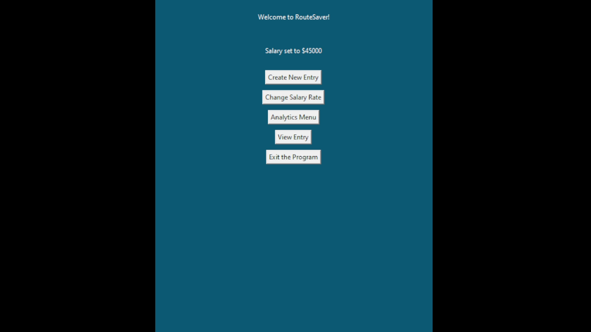

## RouteSaver

RouteSaver is an application designed to help letter carriers keep track of hours worked, pay, and overtime authorization. It was built in May 2020 using python and Tkinter. See the above video (6:20) for a brief demonstration of its functionality.

---
## Techniques

This was my first attempt at using a GUI framework (Tkinter) and by the time I was finished I had a grasp on implementing basic functionality in Tkinter including creating frames, displaying text, creating buttons, creating text input fields, creating text variables and manipulating them with python.

I hard-coded the validation and formatting of form entries in Python. I did not yet know about regular expressions and therefore didn't use them in the code.

The database is stored as a JSON file. As a precaution, a backup folder is automatically created and every save is backed up in incrementally named files with a maximum history of 20 fiels (newest saves replace the oldest).

---
## Final Thoughts

At the time that I built this application, I was self-taught and was aware that I had no idea what I was doing as far as code structure. Nonetheless, I was able to realize my vision (mostly) for the application - it has a user-friendly GUI and works as expected. I used the app myself for several months to keep track of my work data.

If I were to continue work, I would firstly make past entries searchable in a scrolling window and implement keyword searches so that the user could find entries without necessarily knowing the date. I would implement Analytics and provide multiple ways for the user to visualize their aggregate data. Analytics might be printed, saved to file, or emailed for convenience. I might try to beautify the visual design by creating custom button graphics. If I were to implement any changes to the GUI or type of database, I would first need to do some work refactoring the code so that the GUI and database code is decoupled from the main logic (a concept that I was not yet aware of when I built the app).